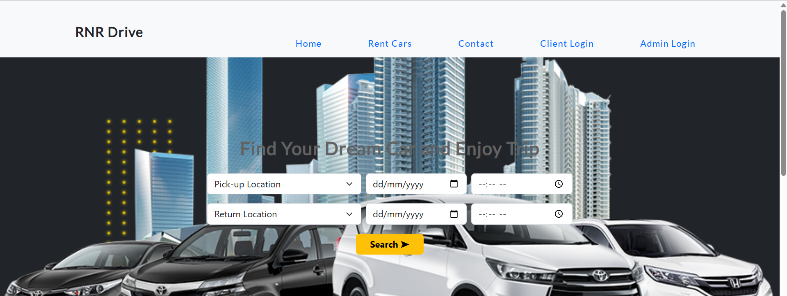
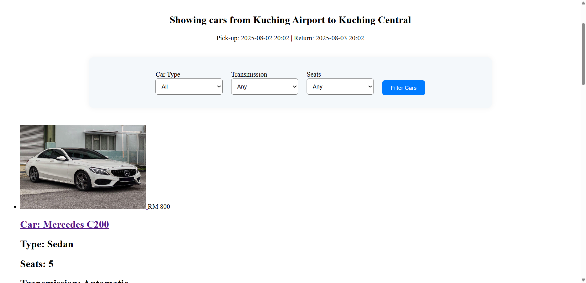
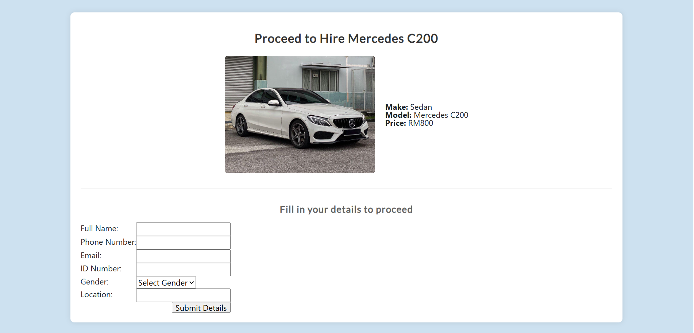
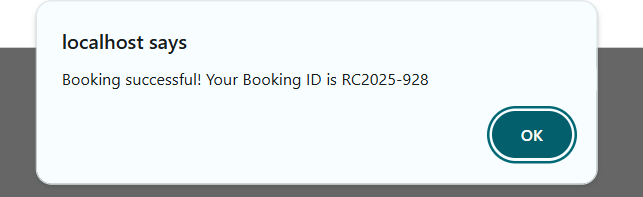
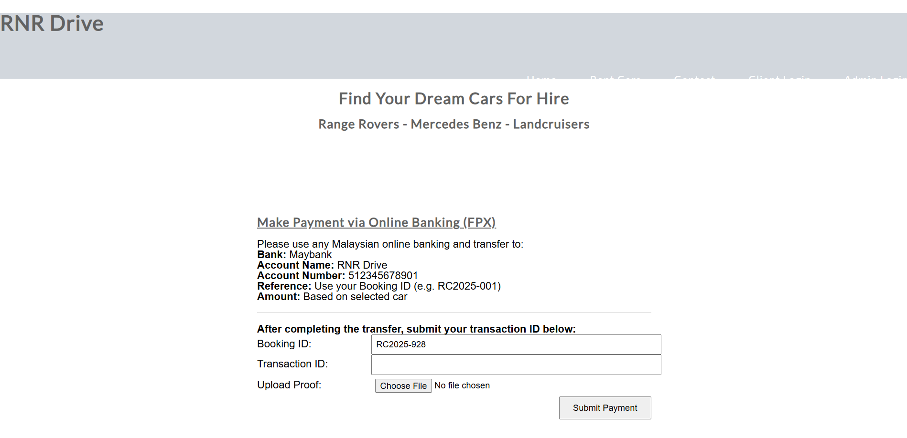
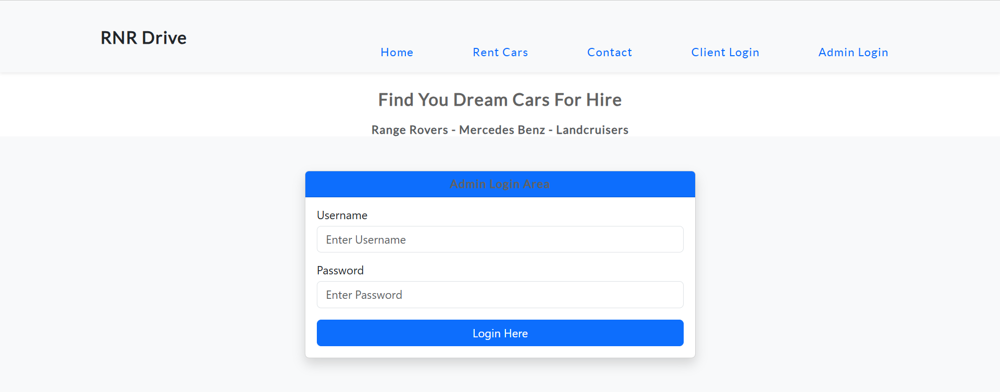
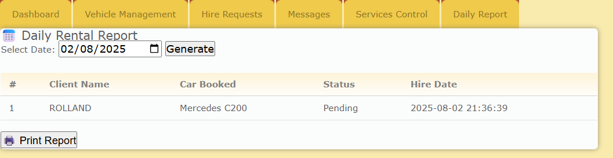
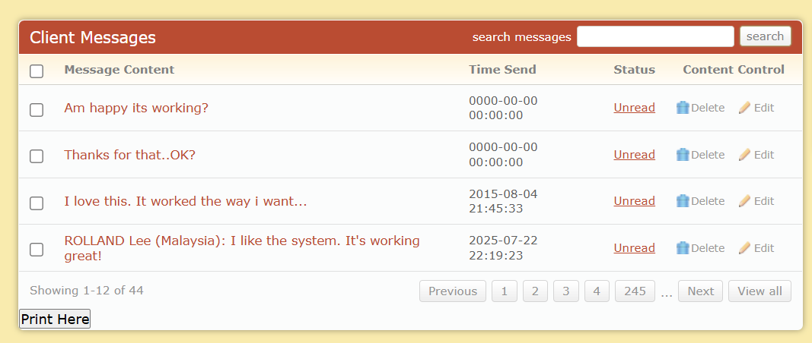

# car-rental-system
A web-based car rental system built using HTML, CSS, JavaScript, PHP, and MySQL.

## 🚗 Features

### ⭐ Client (User) Features
- Browse available rental cars  
- Filter by **Car Type**, **Transmission**, **Number of Seats**  
- View detailed car information  
- Submit booking by filling in personal information  
- Receive generated Booking ID  
- Upload payment proof (FPX transfer slip)  
- Client Login / Registration  
- Send feedback through Contact Form  

---

### 🔧 Admin Features
- Login to Admin Dashboard  
- View & manage all hire/booking requests  
- **Approve / Reject** bookings  
- View uploaded payment proof  
- Manage vehicle information  
- View **Daily Rental Report** with printing option  
- View all client feedback messages  
- Search functions for messages and booking requests

---

## 🏗️ System Architecture
**Frontend:**  
- HTML5  
- CSS3  
- JavaScript  

**Backend:**  
- PHP  
- MySQL (phpMyAdmin)

Database connection file :
db_connect.php

---

## 📸 System Screenshots

### 🏠 Homepage  

### 🚘 Car Listing & Filtering  

### 📄 Car Details / Booking Page  

### 💳 Booking Success Popup  

### 📥 Payment Upload Page  

### 🔑 Admin Login  

### 📋 Admin — Manage Booking Requests  

### 📅 Daily Rental Report  

### 💬 Client Messages (Feedback)  

> Replace images above with your actual paths if needed.

---

## 📦 How to Run the Project

1. Install **XAMPP** (or any local PHP server).  
2. Place the project folder inside:  

3. Import the SQL file into phpMyAdmin:  
- Start Apache & MySQL  
- Open `http://localhost/phpmyadmin`  
- Create a database (e.g., `carrental`)  
- Import `cars.sql`

4. Configure database credentials in :
db_connect.php

5. Run the system in browser:
http://localhost/car-rental-system/
